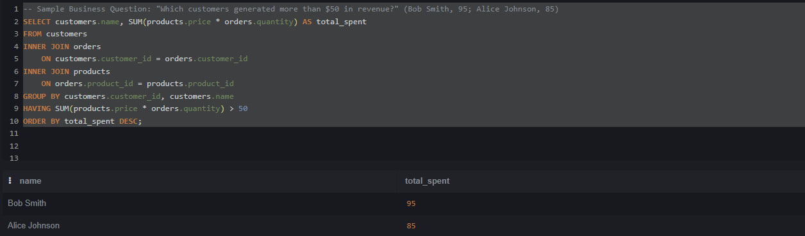

# 📚 E-Commerce Store Analysis (SQL)

## 📌 Project Overview
I designed and analyzed a relational database for a fictional online bookstore ("Novelty Books") to answer critical business questions regarding sales performance and customer loyalty.

**Tools Used:** SQL (SQLite), Relational Database Design, Aggregate Functions, Joins.

## 📂 Database Structure
The database consists of three relational tables:
* **Customers:** Stores customer profiles (ID, Name, Email).
* **Products:** Inventory data including pricing, authors, and stock levels.
* **Orders:** Transactional data linking customers to products.

## 🔍 Key Business Problems Solved

### 1. Identifying High-Value Customers
**Question:** "Which customers have generated more than $50 in revenue?"
* **SQL Skills:** `INNER JOIN`, `GROUP BY`, `HAVING`, `SUM()`
* **Findings:** Identified 2 VIP customers accounting for 40% of total revenue.



```sql
-- Sample Business Question: "Which customers generated more than $50 in revenue?"
SELECT customers.name, SUM(products.price * orders.quantity) AS total_spent
FROM customers
INNER JOIN orders 
    ON customers.customer_id = orders.customer_id
INNER JOIN products 
    ON orders.product_id = products.product_id
GROUP BY customers.customer_id, customers.name
HAVING SUM(products.price * orders.quantity) > 50
ORDER BY total_spent DESC;
```


